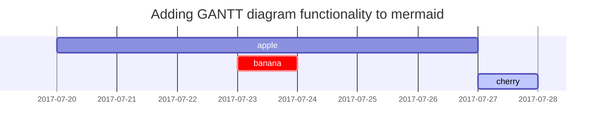

이 글은 [**Chirpy**](https://github.com/cotes2020/jekyll-theme-chirpy/fork)에서 rendering한 마크다운 문법을 보여주며, 예제로 사용해볼 수 있습니다.<br>
지금부터, text와 typography을 살펴보겠습니다.

## Titles (제목)
---
# H1 - heading

<h2 data-toc-skip>H2 - heading</h2>

<h3 data-toc-skip>H3 - heading</h3>

<h4>H4 - heading</h4>
---
<br>

## Paragraph (문단)

나는 구름처럼 외롭게 거닐였다.

높은 계곡과 언덕에 떠다니고,

사람들을 보자마자,

호수 옆 나무 아래 금빛 수선화 한 송이

산들바람에 펄럭이며 춤추고 있다.

## List (목록)

### Ordered list (순서가 있는 목록)

1. 첫번째 항목
2. 두번째 항목
3. 세번째 항목

### Unordered list (순서가 없는 목록)

- 항목 1
	- 하위 항목 1
	- 하위 항목 1

- 항목 2

## Block Quote (인용 블럭)

> This line to shows the Block Quote.

---

## Toggle (토글)

<details>
<summary> 💡 토글할 내용 </summary>
<div markdown="1">

이렇게 내용을 적어줍니다.

</div>
</details>


### Toggle in list (목록형태로 토글)

-  <details><summary> 💡 목록형태 토글1 </summary><div markdown="1">이렇게 내용을 적어줍니다.

-  <details><summary> 💡 목록형태 토글2 </summary><div markdown="1">이렇게 내용을 적어줍니다.
-  동해물과 백두산이 마르고 닳도록.

### Nested Toggle (중첩 토글)

<details>
<summary> 💡 첫번째 토글 </summary>
<div markdown="1">

중첩할 토글 내용은 다음의 내용입니다.

-  <details> <summary> 💡 목록형태로 토글할 내용 </summary><div markdown="1">이렇게 내용을 적어줍니다. 

<details>
<summary> 💡 일반형태로 토글할 내용 </summary>
<div markdown="1">

이렇게 내용을 적어줍니다.

</div>
</details>


</div>
</details>

---

## Tables (표)

| 회사                      | 연락처          | 국가 |
|:-----------------------------|:-----------------|--------:|
| Alfreds Futterkiste          | Maria Anders     | Germany |
| Island Trading               | Helen Bennett    | UK      |
| Magazzini Alimentari Riuniti | Giovanni Rovelli | Italy   |

- [Table(표)안에 Table(표)생성 방법 - stackoverflow](https://stackoverflow.com/questions/26844701/lists-in-markdown-table-with-jekyll)

## Link (링크)

<http://127.0.0.1:4000>


## Footnote (각주)

문장 우상단의 hook을 클릭하면 각주로 이동합니다.[^footnote].


## Youtube 

Youtube 동영상 삽입에는 여러가지 방법이 있으나 제일 간단한 방법을 적습니다.
1. 마음에 드는 Youtube동영상 화면으로 이동한다.
2. 영상에 공유(share)버튼을 클릭한다.
3. < > 모양의 퍼가기를 눌러준다.
4. 해당 코드를 복사, 붙여넣기한다.


<iframe width="560" height="315" src="https://www.youtube.com/embed/fLexgOxsZu0" title="YouTube video player" frameborder="0" allow="accelerometer; autoplay; clipboard-write; encrypted-media; gyroscope; picture-in-picture" allowfullscreen></iframe>

## Images (이미지)

- 기본 (기본 이미지와 밑에 설명추가)


_전체화면 너비(width)와 센터정렬_

<br>

- 특정 너비(width) 설정

{: width="400"}
_400px 이미지 너비(width)_

<br>

- 왼쪽 정렬

{: width="350" class="normal"}

<br>

- 본문 왼쪽에 이미지 삽입 

  {: width="240" class="left"}
  동해물과 백두산이 마르고 닳도록. 동해물과 백두산이 마르고 닳도록.동해물과 백두산이 마르고 닳도록.동해물과 백두산이 마르고 닳도록.동해물과 백두산이 마르고 닳도록.동해물과 백두산이 마르고 닳도록.동해물과 백두산이 마르고 닳도록.동해물과 백두산이 마르고 닳도록.동해물과 백두산이 마르고 닳도록.동해물과 백두산이 마르고 닳도록.동해물과 백두산이 마르고 닳도록.동해물과 백두산이 마르고 닳도록.동해물과 백두산이 마르고 닳도록.동해물과 백두산이 마르고 닳도록.동해물과 백두산이 마르고 닳도록.동해물과 백두산이 마르고 닳도록.동해물과 백두산이 마르고 닳도록.동해물과 백두산이 마르고 닳도록.동해물과 백두산이 마르고 닳도록.동해물과 백두산이 마르고 닳도록.동해물과 백두산이 마르고 닳도록.동해물과 백두산이 마르고 닳도록.동해물과 백두산이 마르고 닳도록.동해물과 백두산이 마르고 닳도록.동해물과 백두산이 마르고 닳도록.

<br>

- 본문 오른쪽에 이미지 삽입 

  {: width="240" class="right"}
 동해물과 백두산이 마르고 닳도록.동해물과 백두산이 마르고 닳도록.동해물과 백두산이 마르고 닳도록.동해물과 백두산이 마르고 닳도록.동해물과 백두산이 마르고 닳도록.동해물과 백두산이 마르고 닳도록.동해물과 백두산이 마르고 닳도록.동해물과 백두산이 마르고 닳도록.동해물과 백두산이 마르고 닳도록.동해물과 백두산이 마르고 닳도록.동해물과 백두산이 마르고 닳도록.동해물과 백두산이 마르고 닳도록.동해물과 백두산이 마르고 닳도록.동해물과 백두산이 마르고 닳도록.동해물과 백두산이 마르고 닳도록.동해물과 백두산이 마르고 닳도록.동해물과 백두산이 마르고 닳도록.동해물과 백두산이 마르고 닳도록.동해물과 백두산이 마르고 닳도록.동해물과 백두산이 마르고 닳도록.동해물과 백두산이 마르고 닳도록.동해물과 백두산이 마르고 닳도록.

<br>

## Mermaid SVG



## Inline code (문장 코드 삽입)

`Inline Code`의 예시입니다.

## Mathematics (수학 표기)

 [**MathJax**](https://www.mathjax.org/)로 작동합니다.:

$$ \sum_{n=1}^\infty 1/n^2 = \frac{\pi^2}{6} $$

\\(a \\) 가  \\(a \ne 0\\)일 때,

\\(ax^2 + bx + c = 0\\)에는 2가지 해가 있고 그 해는 

$$ x = {-b \pm \sqrt{b^2-4ac} \over 2a} $$

## Code Snippet (코드 삽입)

### Common (일반)

```
이 부분은 강조나,line number 문법이 없는 code snippet입니다.
```

### Specific Languages (특정 언어)

#### Console

```console
$ date
Sun Nov  3 15:11:12 CST 2019
```


#### Terminal

```terminal
$ env |grep SHELL
SHELL=/usr/local/bin/bash
PYENV_SHELL=bash
```

#### Ruby

```ruby
def sum_eq_n?(arr, n)
  return true if arr.empty? && n == 0
  arr.product(arr).reject { |a,b| a == b }.any? { |a,b| a + b == n }
end
```

#### Shell

```shell
if [ $? -ne 0 ]; then
    echo "The command was not successful.";
    #do the needful / exit
fi;
```

#### Liquid


```liquid

  This product's title contains the word Pack.

```


#### HTML

```html
<div class="sidenav">
  <a href="#contact">Contact</a>
  <button class="dropdown-btn">Dropdown
    <i class="fa fa-caret-down"></i>
  </button>
  <div class="dropdown-container">
    <a href="#">Link 1</a>
    <a href="#">Link 2</a>
    <a href="#">Link 3</a>
  </div>
  <a href="#contact">Search</a>
</div>
```

**Horizontal Scrolling**

```html
<div class="panel-group">
  <div class="panel panel-default">
    <div class="panel-heading" id="{{ category_name }}">
      <i class="far fa-folder"></i>
      <p>This is a very long long long long long long long long long long long long long long long long long long long long long line.</p>
      </a>
    </div>
  </div>
</div>
```


## Reverse Footnote (각주 설명)

[^footnote]: 각주 설명입니다.
